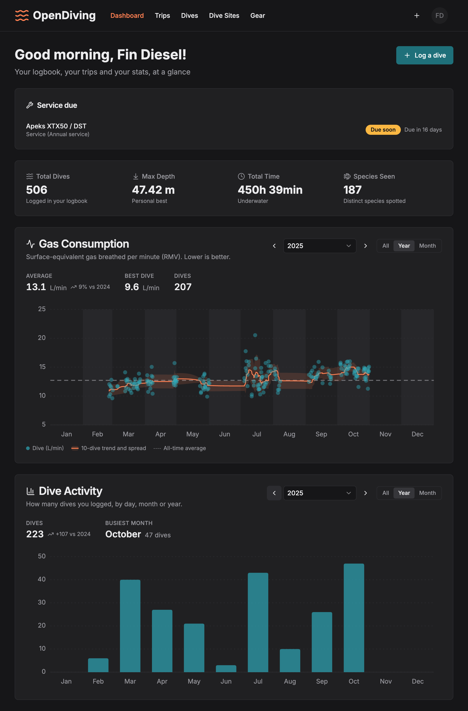
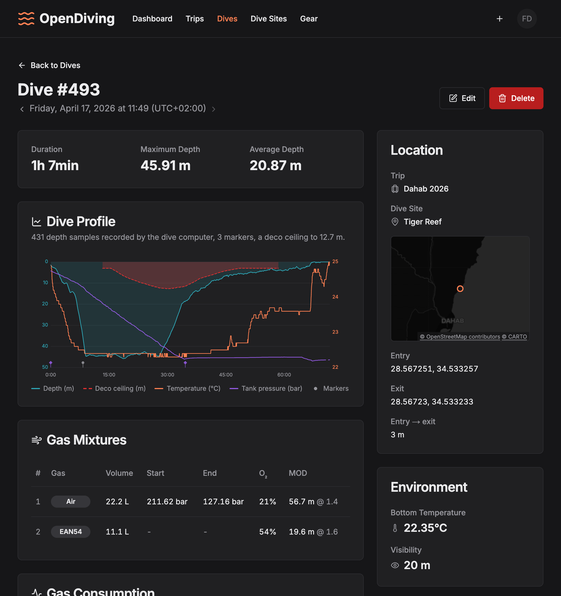
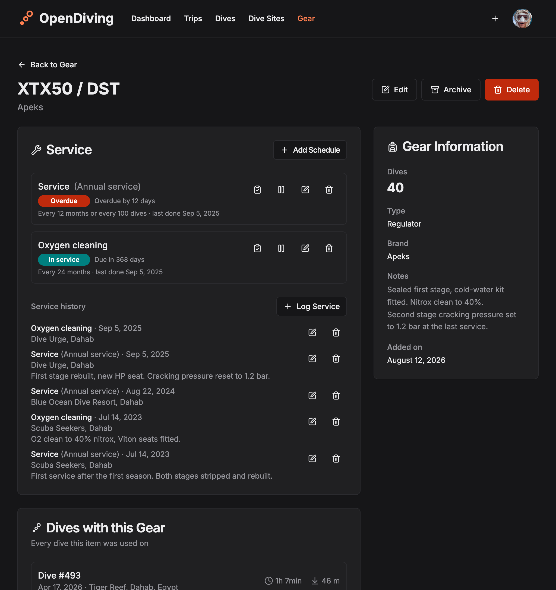

# OpenDiving

**A dive log built to outlive every vendor. Your dives, your data — vendor exports in, open
formats out, everything in one click. Yours to self-host, and this repository is the install.**

OpenDiving is an open-source logbook for scuba divers, recreational and technical: log dives with
multi-tank gas mixtures, import them straight from your dive computer's export files — full
depth/temperature/tank-pressure profile, deco ceiling and dive events included — group them into
trips, and keep your gear service history and c-cards in one place.

Cloud dive logs come and go — Movescount, Deepblu, Diveboard — and when they go, years of dive
history go with them. OpenDiving is built on a different premise: the app is AGPL-licensed, every
dive-computer file you upload to a dive is kept with it, downloadable at any time, and one click
takes everything out in open formats. Self-hosting is what turns that from a promise into a
guarantee — the whole stack is yours to run, on your own machine and your own Postgres, so no
shutdown, acquisition, or paywall can ever take your logbook with it.



## Install

One command, a domain, and a mail relay.

```bash
mkdir opendiving && cd opendiving
curl -LO https://github.com/opendiving/opendiving/releases/latest/download/install.sh
less install.sh       # it is about to write your .env
bash install.sh
```

It checks Docker, fetches the bundle, generates the secrets, asks for the few values only you know,
and stops — leaving you a `.env` and the `docker compose up -d` to run. Four commands and an editor
do the same thing by hand: [install guide](docs/install.md).

Point your domain's DNS record at the machine **before** starting the stack — the bundled Caddy asks
Let's Encrypt for a certificate as it starts, and it can only get one for a name that already
resolves. Then open `https://your-domain`, press **Sign In**, ask for a link, and the first account
to sign in is yours — it carries the operator's rights. A new install is invite-only, so everybody
after you gets in by an invitation you send; `REGISTRATION_MODE=open` is the other setting, and the
[configuration guide](docs/configuration.md#who-may-create-an-account) has both.

That is the whole product: the web app, the API and its worker, PostgreSQL, Redis, and Caddy
terminating TLS with a certificate it fetches itself. Nothing is built — every image is pulled,
prebuilt for **amd64 and arm64**, so a Raspberry Pi runs the same bytes as a VPS. Migrations apply
themselves on startup, so an upgrade is `docker compose pull && docker compose up -d`. A backup is
two artifacts: a `pg_dump` and a tar of the volume the uploaded files live on.

**[Read the install guide first](docs/install.md)** if you'd rather know what you're getting into —
what you need, what the six values are, and what the seven containers do.

| Guide                                              |                                                |
| -------------------------------------------------- | ---------------------------------------------- |
| [Install](docs/install.md)                         | The script, the four commands, what you need   |
| [Configuration](docs/configuration.md)             | Every setting, grouped — and which six matter  |
| [Reverse proxy](docs/reverse-proxy.md)             | Bring your own, or run on a LAN with no domain |
| [Backup & restore](docs/backup-restore.md)         | The dump, the uploaded files, and the drill    |
| [Upgrade](docs/upgrade.md)                         | Pull, up, done — and the stance on downgrades  |
| [Troubleshooting](docs/troubleshooting.md)         | Certificates, mail, rate limits, starting over |

## Features

- **Dive logging** — times, depths, duration, temperature, visibility, water type, altitude, weight,
  notes, and any number of gas mixtures (O₂/He, start/end pressures) per dive. A dive can span
  multiple dive sites, in order, because drift dives happen.
- **Technical diving** — trimix and nitrox mixes get derived gas names and per-mix **MOD** at your
  ppO₂ limit, plus END/EAD; the profile chart shades the **deco ceiling** and marks dive events;
  **CNS/OTU** oxygen exposure and surface pressure are kept from imports, per-cylinder ppO₂ limits
  and gas roles included.
- **Dive-computer import** — upload a FIT file (Garmin Descent, Suunto Ocean/D5) or a Suunto
  XML/JSON export and the form pre-fills itself. Each file lands on a **recording**, one per device
  that recorded the dive: two computers on one dive are two recordings, and one computer's JSON
  beside its FIT is two files of one recording, each filling what the other left blank. Every file
  you upload stays with the recording it came from and can be re-downloaded any time, and the
  per-sample profile is extracted and charted per recording, with a switcher when a dive has more
  than one. A computer that chopped one dive in half logs it as two dives, and **Merge** folds them
  back into one.
- **Air consumption** — SAC and RMV derived automatically, including a per-tank breakdown across
  recorded gas switches, with a consumption trend on the dashboard.
- **Trips, dive sites, species** — group dives into a liveaboard or a holiday week; keep your own
  site list with every dive logged at each; track what you saw.
- **Gear tracking** — equipment with per-item dive counts, groupable into sets you attach to a dive
  in one click, plus service schedules with due-soon reminders on the dashboard and by email.
- **Certifications** — photos of your c-cards on hand at the dive shop, without digging out the
  plastic.
- **Full export** — one click takes _everything_ out in open formats: a
  **[DiveJSON](https://divejson.org)** document — the open dive-log interchange format this
  project publishes and implements — a **UDDF** document other programs import, a **CSV** for a
  spreadsheet, or a complete archive carrying all three, every dive-computer file you uploaded and
  both sides of every c-card. A data-ownership log without an exit door is a contradiction.
- **Logbook import** — and the door swings both ways: bring a whole logbook in from a **DiveJSON**
  document, a full archive, a **UDDF** file, a Subsurface **`.ssrf`**, a **FIT** file, a **Suunto
  app JSON** export, a **Suunto DM5 XML** export, or a zip whose files are all one of those — a
  watch that writes one file per dive arrives as a single upload. You see a preview of exactly what
  will be created, linked or restored before anything is written, and anything a conversion could
  not carry is listed rather than quietly dropped. Converting a logbook brings the dives across, not
  the files behind them; it is the full archive that restores the uploads too, and a deleted dive
  with them, under the identifier it had. An exit door you cannot walk back through is only half of
  owning your data.
- **Passwordless sign-in** — email magic links, a six-digit code, passkeys, or Google. No passwords
  stored, ever.
- **Dark mode and responsive** — works on the boat, in the dive shop, and on your desk.

|                                                                                                     |                                                                                      |
| --------------------------------------------------------------------------------------------------- | ------------------------------------------------------------------------------------ |
|  |  |

## Planned

Roughly in priority order — contributions welcome:

- **More importers** — Shearwater Cloud's whole-database export, which keeps each dive's samples in
  the computer's own binary log rather than in readable rows, so it needs a dive-computer parser
  rather than a format adapter; Shearwater Cloud's UDDF export of the same dives already imports.
  Longer term, [libdivecomputer](https://www.libdivecomputer.org/) for direct hardware support.
- **Statistics** — depth and time records, dives per year, a sites map.
- **Sharing** — a public link to a dive or a trip.
- **iOS companion app** — parked until the server story is done.

## How it compares

Honest answers to "why not X":

- **[Subsurface](https://subsurface-divelog.org/)** — the open-source reference, with unmatched
  dive-computer support and a full deco planner. It's desktop-first, with no web app or
  self-hostable server; OpenDiving is the server-shaped complement — a modern web UI on your own
  box, API-first, reachable from any browser. Use Subsurface to download over a cable, then bring
  its `.ssrf` in whole, so both can hold the same log.
- **[Submersion](https://submersion.app/) / [Bubbletrail](https://bubbletrail.app/)** — excellent
  newer open-source _apps_: local-first, on-device databases, Bluetooth downloads. OpenDiving is the
  household-server alternative: one instance, every browser and family member, one backup, an API.
- **Vendor clouds (Shearwater, Garmin, Suunto, Oceanic+)** — where dives are born, not where they
  should live. OpenDiving reads their exports, and a file you upload to a dive stays with it
  forever, so switching computers never splits your history.

## What is in this repository

The install, and the documentation for running it. Three files —
[`docker-compose.yml`](docker-compose.yml), [`Caddyfile`](Caddyfile) and
[`example.env`](example.env) — plus [`install.sh`](install.sh), which fetches them and writes the
`.env`, plus [`docs/`](docs/). Every release publishes all four as assets, which is what the `curl`
line above fetches, and a release here is the product's release: the version that both images are
tagged with, verified to exist for both architectures before the notes are ever written.

The application itself lives next door:

|                                                                |                                                       |
| -------------------------------------------------------------- | ----------------------------------------------------- |
| [opendiving-api](https://github.com/opendiving/opendiving-api) | FastAPI backend — Postgres, Redis, dive-file parsing  |
| [opendiving-web](https://github.com/opendiving/opendiving-web) | Next.js web app                                       |
| [opendiving-ios](https://github.com/opendiving/opendiving-ios) | SwiftUI app (early scaffold, parked)                  |

Each carries its own `CONTRIBUTING.md` with its setup, its checks and its house rules, and its own
`DECISIONS.md` recording the non-obvious choices already made. Working on the app means working in
one of those; this repository is where the two of them become something you can install.

## Contributing

Issues and pull requests are welcome — a typo in the install guide as much as a new importer. Open
an issue first for anything large, so the shape can be agreed before the work.

An issue about **installing, upgrading, backing up or configuring** an instance belongs here. A bug
in the app itself belongs in `opendiving-api` or `opendiving-web`; if you can't tell which, open it
here and it will be moved. Security problems go through [SECURITY.md](SECURITY.md) rather than the
issue tracker.

## License

[AGPL-3.0](LICENSE). In short: run it, change it, self-host it freely — but if you offer a modified
version as a service, you share your changes. Nobody gets to take this closed-source and lock
divers' data away.
